# Dashboard Navigation Architecture

> **Last Updated**: 2025-10-21
> **Components**: DashboardNavbar, DashboardSidebar, SecondarySidebarDrawer
> **Purpose**: Visual architecture documentation for the three-tier navigation system

---

## 📋 Table of Contents

1. [System Overview](#system-overview)
2. [Component Hierarchy](#component-hierarchy)
3. [Data Flow Architecture](#data-flow-architecture)
4. [User Interaction Sequences](#user-interaction-sequences)
5. [State Management](#state-management)
6. [Technical Dependencies](#technical-dependencies)
7. [Event Flow Diagrams](#event-flow-diagrams)

---

## 🏗️ System Overview

The dashboard navigation system implements a **three-tier architecture** with progressive disclosure:

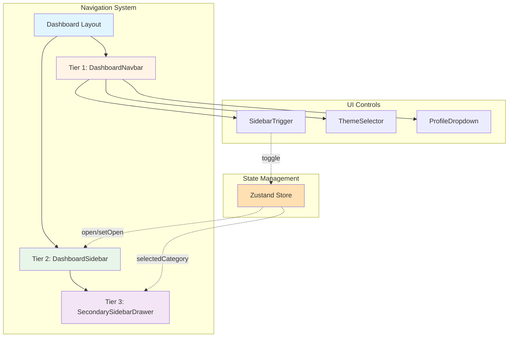

**Navigation Tiers:**
- **Tier 1 (Navbar)**: Top-level controls (hamburger, theme, profile)
- **Tier 2 (Sidebar)**: Main navigation menu (Admin, Educators, Guardians, Learners)
- **Tier 3 (Drawer)**: Category-specific sub-navigation (appears on hover/click)

---

## 🌳 Component Hierarchy

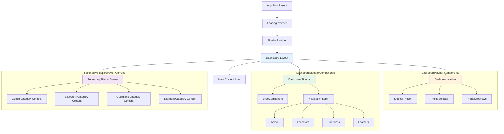

**Component Relationships:**
- **Parent → Child**: Layout wraps all navigation components
- **Sibling Communication**: Via Zustand store (sidebar state)
- **Event Propagation**: Click/Hover → State Update → UI Re-render

---

## 🔄 Data Flow Architecture

### Props & State Flow

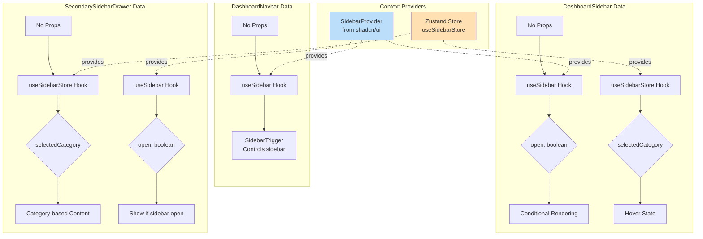

### State Updates Flow

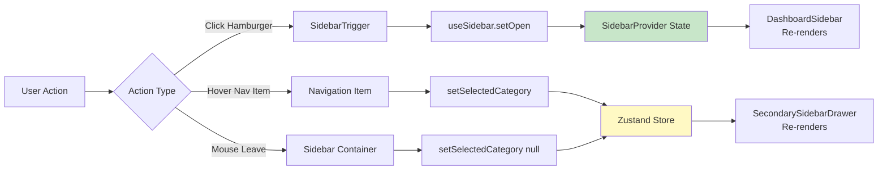

---

## 👆 User Interaction Sequences

### Sequence 1: Opening Sidebar

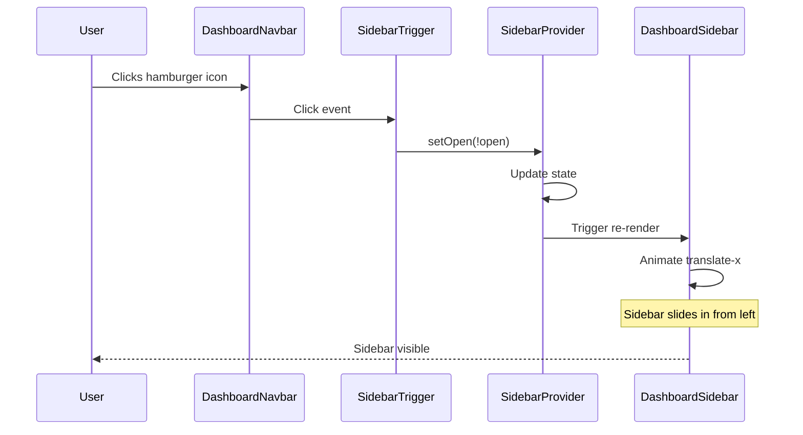

### Sequence 2: Navigating with Secondary Drawer

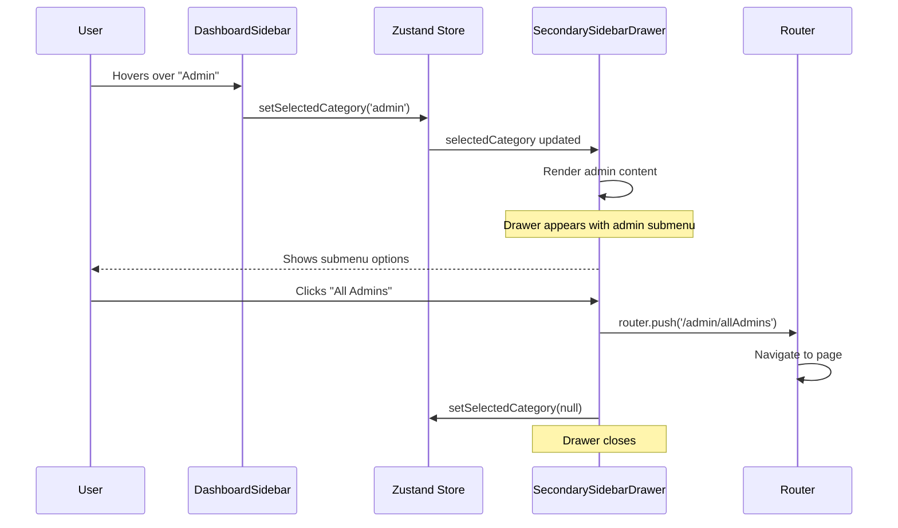

### Sequence 3: Theme Change Flow

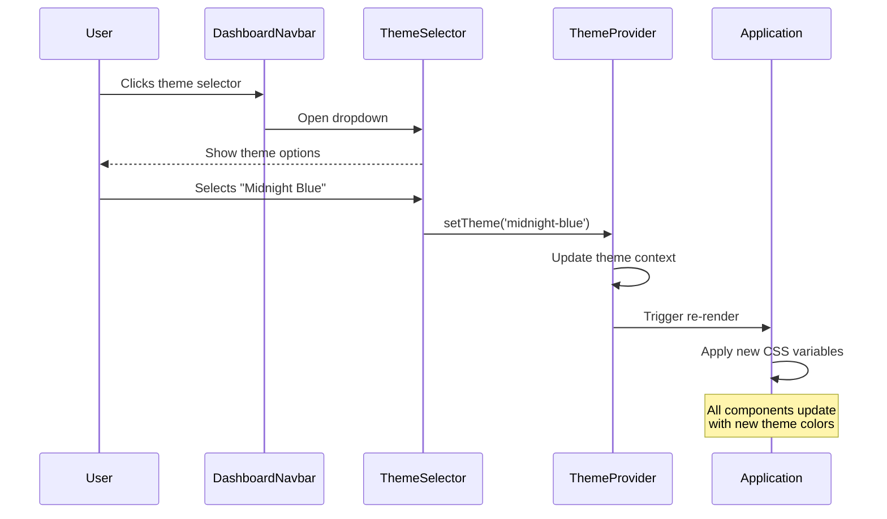

---

## 🔧 State Management

### Zustand Store Structure

```mermaid
graph TB
    subgraph "useSidebarStore"
        State[Store State]
        State --> SC[selectedCategory: string | null]
        State --> SSC[setSelectedCategory: function]
    end

    subgraph "State Values"
        SC --> Null[null - No drawer]
        SC --> Admin["'admin' - Admin drawer"]
        SC --> Edu["'educators' - Educators drawer"]
        SC --> Guard["'guardians' - Guardians drawer"]
        SC --> Learn["'learners' - Learners drawer"]
    end

    subgraph "Actions"
        SSC --> Set[Set category on hover]
        SSC --> Clear[Clear on mouse leave]
        SSC --> Navigate[Clear on navigation]
    end

    style State fill:#fff3e0
```

### State Transitions

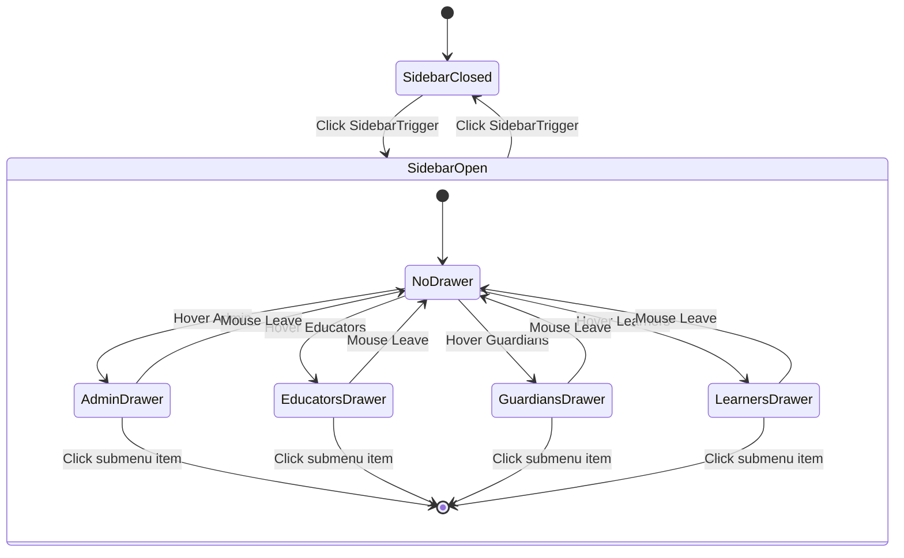

---

## 🔌 Technical Dependencies

```mermaid
graph LR
    subgraph "DashboardNavbar"
        N1[DashboardNavbar.tsx]
        N1 --> N2[@/components/ui/sidebar]
        N1 --> N3[@/components/theme/ThemeSelector]
        N1 --> N4[@/components/utilities/ProfileDropdown]
        N1 --> N5[@/components/glass/GlassNavbar]
    end

    subgraph "DashboardSidebar"
        S1[DashboardSidebar.tsx]
        S1 --> S2[@/components/ui/sidebar]
        S1 --> S3[@/components/utilities/LogoComponent]
        S1 --> S4[zustand]
        S1 --> S5[next/navigation]
        S1 --> S6[lucide-react]
    end

    subgraph "SecondarySidebarDrawer"
        D1[SecondarySidebarDrawer.tsx]
        D1 --> D2[@/components/ui/sidebar]
        D1 --> D3[@/components/ui/sheet]
        D1 --> D4[zustand]
        D1 --> D5[next/navigation]
        D1 --> D6[lucide-react]
    end

    subgraph "External Libraries"
        shadcn[shadcn/ui]
        zustand[Zustand]
        nextjs[Next.js]
        lucide[Lucide Icons]
    end

    N2 --> shadcn
    S2 --> shadcn
    D2 --> shadcn
    D3 --> shadcn

    S4 --> zustand
    D4 --> zustand

    S5 --> nextjs
    D5 --> nextjs

    S6 --> lucide
    D6 --> lucide

    style shadcn fill:#e1f5fe
    style zustand fill:#fff9c4
    style nextjs fill:#e8f5e9
    style lucide fill:#f3e5f5
```

---

## ⚡ Event Flow Diagrams

### Complete User Journey

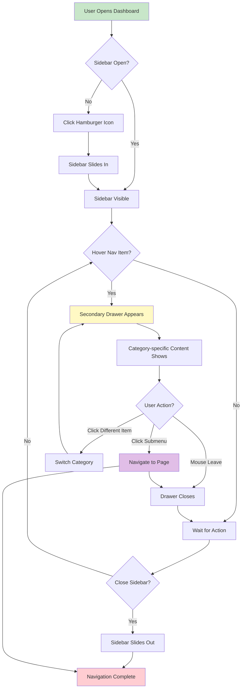

### Responsive Behavior Flow

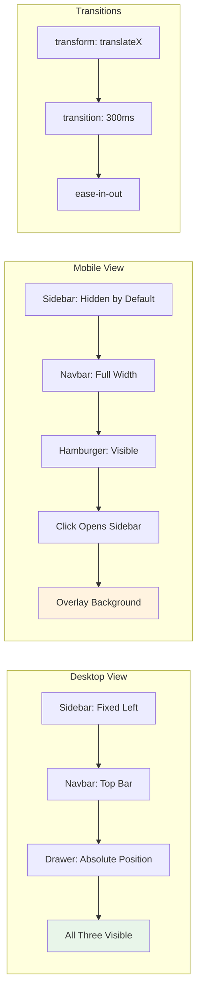

---

## 📊 Navigation Menu Structure

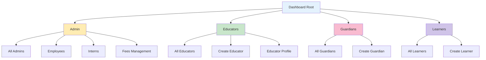

---

## 🎨 Component Communication Pattern

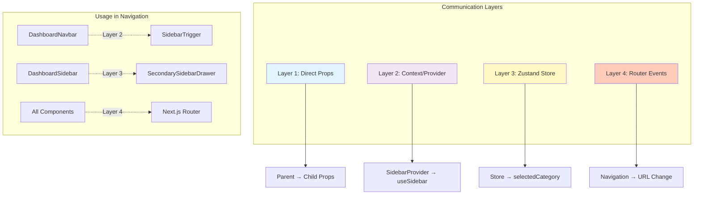

---

## 📝 Summary

### Architecture Highlights

✅ **Three-Tier Design**: Progressive disclosure pattern (Navbar → Sidebar → Drawer)
✅ **State Management**: Hybrid approach (SidebarProvider + Zustand)
✅ **Responsive**: Mobile-first with transform animations
✅ **Type-Safe**: Full TypeScript integration
✅ **Accessible**: Keyboard navigation and ARIA support
✅ **Themeable**: Integrates with theme system

### Key Design Patterns

- **Provider Pattern**: SidebarProvider wraps layout
- **Custom Hook Pattern**: useSidebar, useSidebarStore
- **Render Props Pattern**: Conditional rendering based on state
- **Observer Pattern**: State changes trigger re-renders
- **Progressive Disclosure**: Three-tier navigation reveals details gradually

### Performance Optimizations

- **CSS Transforms**: Hardware-accelerated animations
- **Conditional Rendering**: Only render active drawer content
- **Event Delegation**: Efficient hover/click handling
- **Lazy Loading**: Components load on-demand
- **Memoization**: Prevent unnecessary re-renders

---

**Last Updated**: 2025-10-21
**Documentation Version**: 1.0
**Maintained By**: Development Team
